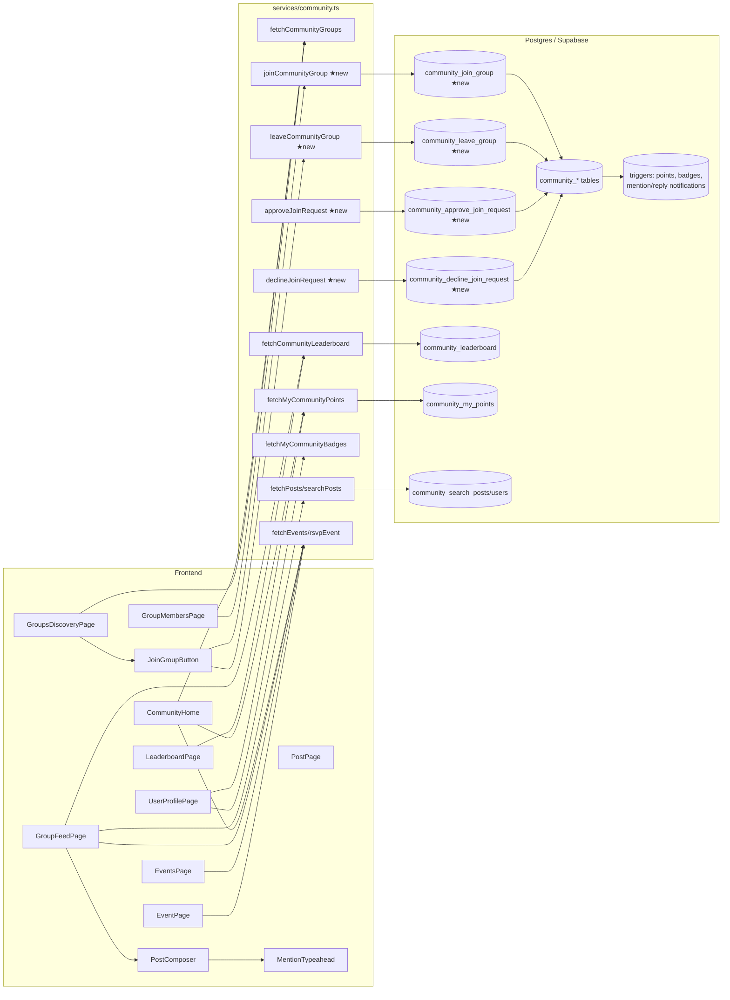

# Community Feature — Implementation Plan

Audit of the existing community implementation in Capp2, the gaps in the user-facing route, and the build order to ship a complete experience.

---

## 1. What Exists Today

### 1.1 User-facing routes

Defined in [App.tsx:692–731](frontend/src/App.tsx). The four "deep" routes are gated to `ADMIN` unless `VITE_COMMUNITY_PUBLIC_ENABLED=true` ([App.tsx:555](frontend/src/App.tsx)).

| Route | File | Status |
|---|---|---|
| `/community` | [CommunityPage.tsx](frontend/src/community/CommunityPage.tsx) | "Coming Soon" splash, all signed-in users |
| `/community/groups/:groupId` | [GroupFeedPage.tsx](frontend/src/community/GroupFeedPage.tsx) | Group hub: Feed / Events / Leaderboard / About |
| `/community/posts/:postId` | [PostPage.tsx](frontend/src/community/PostPage.tsx) | Post detail + comments + mod actions |
| `/community/events` | [EventsPage.tsx](frontend/src/community/EventsPage.tsx) | Calendar + agenda |
| `/community/events/:eventId` | [EventPage.tsx](frontend/src/community/EventPage.tsx) | Event detail + RSVP |

Sidebar entry: [UserNavigationSidebar.tsx:144](frontend/src/components/UserNavigationSidebar.tsx) (always visible, points to `/community`).

Shared UI: [PostComposer.tsx](frontend/src/community/components/PostComposer.tsx), [MentionTypeahead.tsx](frontend/src/community/components/MentionTypeahead.tsx).

Service layer: [services/community.ts](frontend/src/services/community.ts) — ~60 functions (groups, sections, posts, comments, likes, mentions, events, RSVPs, leaderboard, badges, reports).

### 1.2 Admin route

`/admin/community` (CommunityAdminPage) — Groups list, group settings, members, sections (drag-reorder), reports.

### 1.3 Backend — DB & RPCs

Migrations in `backend/migrations/20260117_*` and `20260122_*`.

**Tables:** `community_groups`, `community_sections`, `community_posts`, `community_comments`, `community_post_likes`, `community_comment_likes`, `community_mentions`, `community_group_members`, `community_events`, `community_event_rsvps`, `community_points_events`, `community_badges`, `community_user_badges`, `community_reports`.

**RPCs already in place:**
- `community_search_users`, `community_search_posts`
- `community_set_post_pinned`, `community_set_post_locked`, `community_move_post_section`, `community_restore_post`
- `community_leaderboard(p_group_id uuid DEFAULT NULL, …)` — supports global view when `group_id IS NULL`
- `community_my_points`, `community_can_access_group`
- `community_insert_points_event`, `community_award_badges_for_user`

**Triggers already firing:**
- Points on post create, comment create, post-like received, comment-like received, event create, RSVP "going" — [gamification.sql:424–499](backend/migrations/20260122_zzz_community_gamification.sql)
- Auto badge-award after every points event — [gamification.sql:167](backend/migrations/20260122_zzz_community_gamification.sql)
- Mention notification enqueue — [mentions_and_notifications.sql:181](backend/migrations/20260117_community_mentions_and_notifications.sql)
- Reply notification enqueue — [mentions_and_notifications.sql:185](backend/migrations/20260117_community_mentions_and_notifications.sql)
- `community.mention` and `community.reply` notification categories seeded with user prefs

RLS enforced on every table; restricted groups gate post/comment visibility to members.

---

## 2. Gaps in the User Route

### 2.1 Missing pages

| Page | Route | Backend ready? |
|---|---|---|
| Groups discovery | `/community/groups` | Yes |
| My profile (points + badges) | `/community/me` | Yes |
| Global leaderboard | `/community/leaderboard` | Yes |
| Group members directory | `/community/groups/:groupId/members` | Yes |
| Real `/community` home (replace splash) | `/community` | Yes |

### 2.2 Join-group flow — missing on both ends

`join_policy` (`open` / `request` / `invite`) exists on the schema but there is no RPC and no service wrapper that lets a user actually join. This is the largest blocker.

**Backend RPCs to add (one new migration):**
- `community_join_group(p_group_id)` — validates visibility + policy, inserts membership as `active` (open) or `pending` (request), rejects `invite`-only.
- `community_leave_group(p_group_id)`
- `community_approve_join_request(p_group_id, p_user_id)` — admin/moderator
- `community_decline_join_request(p_group_id, p_user_id)` — admin/moderator

**Frontend:**
- `JoinGroupButton` component (handles all three policy paths)
- Service wrappers in `services/community.ts`
- "Join Requests" panel inside CommunityAdminPage

### 2.3 Feature flag

`VITE_COMMUNITY_PUBLIC_ENABLED` is currently false. Even an authenticated user hitting `/community/groups/:id` lands on Access Required. Flip after 2.1 + 2.2 ship, or remove the gate entirely.

### 2.4 Lower-priority polish

- Event reminder cron: [backend/cron/index.js](backend/cron/index.js) doesn't poll `community_events`. Notifications path is ready; just needs a worker that creates 24h/1h-out notifications for "going" RSVPs.
- Post/comment edit UI: `edited_at` column exists, no edit RPC or affordance.
- Media attachments: text-only today.
- Community-filtered NotificationsPage view + live mention toasts.

---

## 3. Build Order

1. **Backend migration**: `community_join_group` + `leave` + `approve` + `decline` RPCs.
2. **GroupsDiscoveryPage** + `JoinGroupButton` + service wrappers + new route.
3. **`/community` home** — replace splash with: your groups, upcoming RSVP'd events, recent activity, links to discovery / leaderboard / profile.
4. **UserProfilePage** (points + badges); link from MyHeaderProfile menu.
5. **LeaderboardPage** (global) — existing RPC, new component.
6. **GroupMembersPage**.
7. **Admin: Join Requests panel** in CommunityAdminPage.
8. **Flip `VITE_COMMUNITY_PUBLIC_ENABLED`** (or remove the gate).
9. **Polish:** event-reminder cron, post/comment edit, community-filtered notifications view.

---

## 4. User Flow Architecture

### 4.1 Site map

```
/community  (HOME — replace splash)
│
├─ /community/groups                       Discover & join groups
│   │
│   └─ /community/groups/:groupId          Group hub
│       ├─ ?tab=feed       (default)        Posts, composer
│       ├─ ?tab=events                      Group events
│       ├─ ?tab=leaderboard                 Per-group ranking
│       ├─ ?tab=about                       Description, rules
│       └─ /members                         Member directory
│
├─ /community/posts/:postId                Post detail + thread
│
├─ /community/events                       Cross-group calendar
│   └─ /community/events/:eventId          Event detail + RSVP
│
├─ /community/leaderboard                  Global ranking
│
└─ /community/me                           My points + badges
```

### 4.2 Primary user flows

```mermaid
flowchart TD
    Start([User clicks Community in sidebar]) --> Home[/community HOME/]

    Home --> Discover[/community/groups<br/>Discover Groups/]
    Home --> MyGroups[Click a group I'm in]
    Home --> Events[/community/events]
    Home --> Profile[/community/me]
    Home --> Leaderboard[/community/leaderboard]

    Discover --> GroupCard{Click group card}
    GroupCard -->|already member| GroupHub[/community/groups/:id]
    GroupCard -->|policy=open| JoinOpen[Click Join → instant]
    GroupCard -->|policy=request| JoinReq[Click Request → pending]
    GroupCard -->|policy=invite| Locked[Locked: invite only]

    JoinOpen --> GroupHub
    JoinReq --> Pending[Pending state shown]
    Pending -.admin approves.-> GroupHub

    MyGroups --> GroupHub
    GroupHub --> Feed[Feed tab]
    GroupHub --> GEvents[Events tab]
    GroupHub --> GLeader[Leaderboard tab]
    GroupHub --> About[About tab]
    GroupHub --> Members[/community/groups/:id/members/]

    Feed --> Compose[Compose post @mention]
    Feed --> PostDetail[/community/posts/:id]
    PostDetail --> Comment[Reply with @mention]

    GEvents --> EventDetail[/community/events/:id]
    Events --> EventDetail
    EventDetail --> RSVP[RSVP going/interested/declined]

    Compose -. trigger .-> PointsT[(community_points_events<br/>+post create points)]
    Comment -. trigger .-> PointsC[(community_points_events<br/>+comment create points)]
    RSVP -. trigger going .-> PointsR[(community_points_events<br/>+rsvp going points)]
    PointsT & PointsC & PointsR -. after_insert .-> Badges[(community_user_badges<br/>auto-award)]

    Compose -. mention insert .-> Notif[(notifications<br/>community.mention)]
    Comment -. comment insert .-> Reply[(notifications<br/>community.reply)]
```

### 4.3 Wireframes (text)

#### `/community` — HOME (new)

```
┌──────────────────────────────────────────────────────────────────────┐
│  COMMUNITY                                          [Discover groups]│
├──────────────────────────────────────────────────────────────────────┤
│                                                                      │
│   YOUR GROUPS                                              See all → │
│   ┌──────────┐ ┌──────────┐ ┌──────────┐ ┌──────────┐                │
│   │ cover    │ │ cover    │ │ cover    │ │ cover    │                │
│   │ Group A  │ │ Group B  │ │ Group C  │ │ Group D  │                │
│   │ 142 mem  │ │ 38 mem   │ │ 1.2k mem │ │ 9 mem    │                │
│   └──────────┘ └──────────┘ └──────────┘ └──────────┘                │
│                                                                      │
│   UPCOMING EVENTS (you RSVP'd)                              All →    │
│   • Apr 30 · 2:00pm · Print-on-demand AMA      ► Group A             │
│   • May 04 · 10:00am · Etsy Q&A workshop       ► Group C             │
│                                                                      │
│   ACTIVITY                                                           │
│   • @kiri replied to your post in Group A · 12m ago                  │
│   • You earned the "First Post" badge · 1d ago                       │
│   • New event in Group C: "May Workshop" · 2d ago                    │
│                                                                      │
│   ┌──────────────────┐  ┌──────────────────┐  ┌──────────────────┐   │
│   │ Discover Groups  │  │ Global Leader…   │  │ My Points        │   │
│   └──────────────────┘  └──────────────────┘  └──────────────────┘   │
└──────────────────────────────────────────────────────────────────────┘
```

#### `/community/groups` — Discover

```
┌──────────────────────────────────────────────────────────────────────┐
│  DISCOVER GROUPS                       [Search…]   [Filter: All ▼]   │
├──────────────────────────────────────────────────────────────────────┤
│ ┌─────────────────────┐  ┌─────────────────────┐                     │
│ │ ░ cover ░░░░░░░░░░░ │  │ ░ cover ░░░░░░░░░░░ │                     │
│ │                     │  │                     │                     │
│ │ Group A      🌐 open│  │ Group B      🔒 req │                     │
│ │ Short description…  │  │ Short description…  │                     │
│ │ 142 members · 24 p  │  │ 38 members · 6 p    │                     │
│ │ [Join]              │  │ [Request access]    │                     │
│ └─────────────────────┘  └─────────────────────┘                     │
│                                                                      │
│ ┌─────────────────────┐  ┌─────────────────────┐                     │
│ │ Group C    ✓ joined │  │ Group D     ✉ invite│                     │
│ │ ...                 │  │ ...                 │                     │
│ │ [Open]              │  │ [Invite only]       │                     │
│ └─────────────────────┘  └─────────────────────┘                     │
└──────────────────────────────────────────────────────────────────────┘
```

#### `/community/groups/:groupId` — Group Hub (exists)

```
┌──────────────────────────────────────────────────────────────────────┐
│  ← Discover     [Group A cover banner]                               │
│                                                                      │
│  GROUP A                                          [Members 142 →]    │
│  ✓ Joined · public · open join                                       │
│                                                                      │
│  [ Feed ]  [ Events ]  [ Leaderboard ]  [ About ]                    │
├──────────────────────────────────────────────────────────────────────┤
│  Section: General ▼          [Search…]                               │
│                                                                      │
│  ┌────────────────────────────────────────────────────┐              │
│  │  📝 What's on your mind, @you?                     │              │
│  └────────────────────────────────────────────────────┘              │
│                                                                      │
│  📌 Pinned · Welcome thread — by mod · 3 likes · 12 cm               │
│  ─────────────────────────────────────────────────────               │
│  Post title — by @kiri · 4h                                          │
│  Body preview...                              ❤ 8   💬 3   ⋯         │
└──────────────────────────────────────────────────────────────────────┘
```

#### `/community/groups/:groupId/members` (new)

```
┌──────────────────────────────────────────────────────────────────────┐
│  ← Group A            MEMBERS                          [Search…]     │
├──────────────────────────────────────────────────────────────────────┤
│  ●  Vain & Able        moderator       142 pts                       │
│  ●  Kiri Tanaka        member          88 pts                        │
│  ●  Jonas Reed         member          77 pts                        │
│  ●  …                                                                │
└──────────────────────────────────────────────────────────────────────┘
```

#### `/community/leaderboard` (new)

```
┌──────────────────────────────────────────────────────────────────────┐
│  GLOBAL LEADERBOARD     [ This week | This month | All time ]        │
├──────────────────────────────────────────────────────────────────────┤
│  #1  ●  Kiri Tanaka          1,204 pts        🥇                     │
│  #2  ●  Jonas Reed             988 pts        🥈                     │
│  #3  ●  Vain & Able            812 pts        🥉                     │
│  #4  ●  …                                                            │
│  ...                                                                 │
│  #58 ●  YOU                    142 pts        ↑ 4                    │
└──────────────────────────────────────────────────────────────────────┘
```

#### `/community/me` (new)

```
┌──────────────────────────────────────────────────────────────────────┐
│  MY COMMUNITY PROFILE                                                │
├──────────────────────────────────────────────────────────────────────┤
│  ●  Vain & Able                                                      │
│     zacharyh@completeful.com                                         │
│                                                                      │
│  POINTS                                                              │
│  ┌──────────────┐ ┌──────────────┐ ┌──────────────┐                  │
│  │  142  Total  │ │  24  Week    │ │  68  Month   │                  │
│  └──────────────┘ └──────────────┘ └──────────────┘                  │
│                                                                      │
│  PER GROUP                                                           │
│  • Group A   88 pts                                                  │
│  • Group C   54 pts                                                  │
│                                                                      │
│  BADGES                                                              │
│  🏅 First Post  🏅 10 Posts  🏅 Helpful Reply  🔒 Top Contributor    │
└──────────────────────────────────────────────────────────────────────┘
```

### 4.4 Component / data dependency graph



### 4.5 Permission matrix

| Action | Anonymous | Auth user (non-member) | Member | Moderator | Admin |
|---|---|---|---|---|---|
| View `/community` home | ❌ | ✅ | ✅ | ✅ | ✅ |
| Browse `/community/groups` | ❌ | ✅ | ✅ | ✅ | ✅ |
| Read posts in public group | ❌ | ✅ | ✅ | ✅ | ✅ |
| Read posts in restricted group | ❌ | ❌ | ✅ | ✅ | ✅ |
| Join open group | ❌ | ✅ instant | n/a | n/a | n/a |
| Request to join | ❌ | ✅ pending | n/a | n/a | n/a |
| Post / comment | ❌ | ❌ | ✅ | ✅ | ✅ |
| Like / @mention / report | ❌ | ❌ | ✅ | ✅ | ✅ |
| RSVP event | ❌ | ❌ | ✅ | ✅ | ✅ |
| Pin / lock / move post | ❌ | ❌ | ❌ | ✅ | ✅ |
| Approve join requests | ❌ | ❌ | ❌ | ✅ | ✅ |
| Manage groups / sections / reports | ❌ | ❌ | ❌ | ❌ | ✅ |

Enforced by RLS + RPC `SECURITY DEFINER` checks; UI reflects the same gates.

---

## 5. Files to Touch

**New (frontend):**
- `frontend/src/community/CommunityHome.tsx` (replaces splash content of CommunityPage)
- `frontend/src/community/GroupsDiscoveryPage.tsx`
- `frontend/src/community/GroupMembersPage.tsx`
- `frontend/src/community/LeaderboardPage.tsx`
- `frontend/src/community/UserProfilePage.tsx`
- `frontend/src/community/components/JoinGroupButton.tsx`

**Modify (frontend):**
- `frontend/src/App.tsx` — register new routes, drop the ADMIN gate after backend ships
- `frontend/src/services/community.ts` — `joinCommunityGroup`, `leaveCommunityGroup`, `approveJoinRequest`, `declineJoinRequest`
- `frontend/src/admin/CommunityAdminPage.tsx` — Join Requests panel
- `frontend/src/MyHeaderProfile.tsx` — link to `/community/me`

**New (backend):**
- `backend/migrations/20260427_community_join_group.sql` — the four RPCs above
- (later) `backend/services/communityEventReminders.js` + cron entry in `backend/cron/index.js`

## Related
- [[02 App & Product/Canvas Designer Route Node Map|Canvas Designer — Route Node Map]]
- [[02 App & Product/Completeful (Capp2) Route Node Map|Completeful (Capp2) — Route Node Map]]
- [[02 App & Product/Completeful App 3.0 Architecture|Completeful App 3.0 Architecture]]
- [[02 App & Product/Completeful — Feature Build Plans|Completeful — Feature Build Plans]]
- [[02 App & Product/App Overview & Capabilities|App Overview & Capabilities]]
